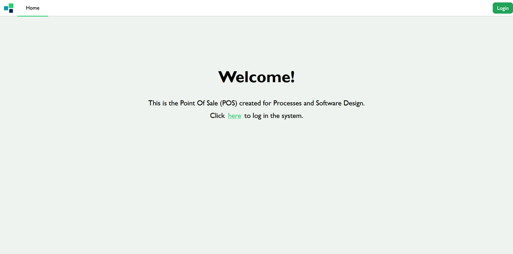
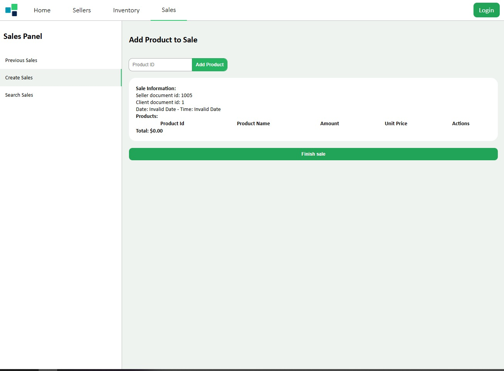
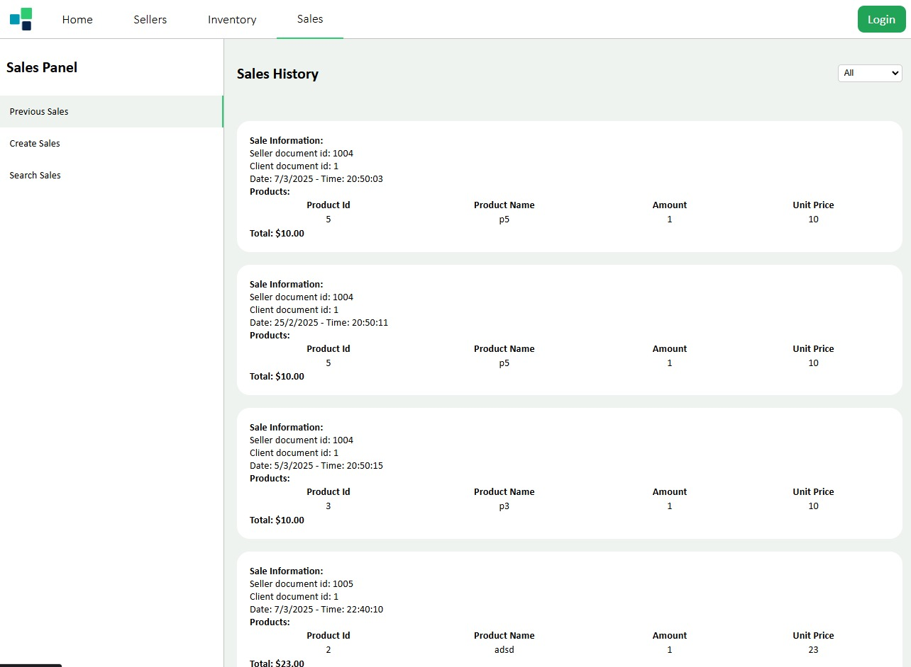
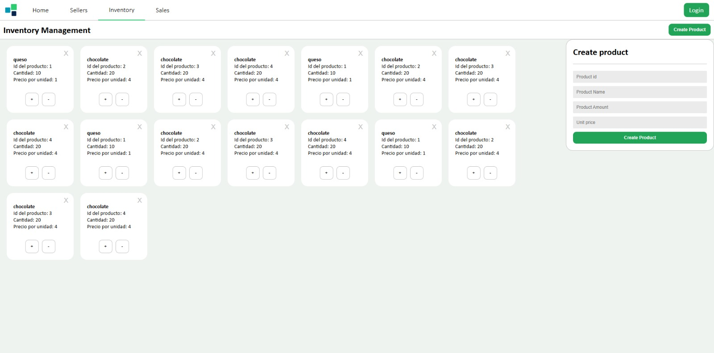

# POS_system

This point-of-sale system aims to implement tools that are useful for recording purchases, storing information, and updating inventory.

## Register Purchases
Allows a salesperson to register a purchase with the products to be bought and customer information.

## View Sales
Allows reviewing previously made purchases.

## Inventory Management
Allows registering available products, increasing or decreasing their quantity.

